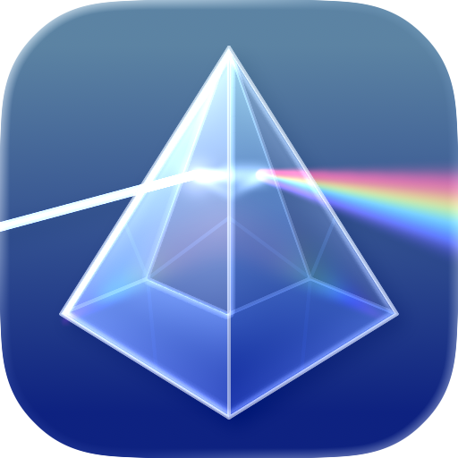

<p align="center">
  
</p>

<h1 align="center">Clearly</h1>

<p align="center">適用於 Mac 的 Markdown 編輯器與知識庫。</p>

<p align="center">
  <a href="../README.md">English</a> ·
  <a href="./README.zh-Hans.md">简体中文</a> ·
  <a href="./README.zh-Hant.md">繁體中文</a> ·
  <a href="./README.ja.md">日本語</a> ·
  <a href="./README.ko.md">한국어</a> ·
  <a href="./README.es.md">Español</a> ·
  <a href="./README.ru.md">Русский</a> ·
  <a href="./README.fr.md">Français</a> ·
  <a href="./README.de.md">Deutsch</a> ·
  <a href="./README.it.md">Italiano</a>
</p>

<p align="center">
  <a href="https://apps.apple.com/app/clearly-markdown/id6760669470">Mac App Store</a> &middot;
  <a href="https://github.com/Shpigford/clearly/releases/latest/download/Clearly.dmg">直接下載</a> &middot;
  <a href="https://clearly.md">網站</a> &middot;
  <a href="https://x.com/Shpigford">@Shpigford</a>
</p>

<p align="center">
  
</p>

邊寫邊高亮，用 `wiki-links` 串連想法，搜尋所有內容，並獲得精美預覽。原生 macOS 體驗，沒有 Electron，沒有訂閱。

## 功能特色

### 寫作

- **語法高亮** — 標題、粗體、斜體、連結、程式碼區塊、表格都會在輸入時即時高亮
- **格式快捷鍵** — ⌘B 粗體，⌘I 斜體，⌘K 插入連結
- **擴充 Markdown** — 支援 `==高亮==`、`^上標^`、`~下標~`、`:emoji:` 短碼與 `[TOC]` 目錄產生
- **Scratchpad** — 帶有全域快捷鍵的選單列速記板

### 知識管理

- **Wiki 連結** — 使用 `[[wiki-links]]` 串連文件，輸入 `[[` 即可自動補全
- **反向連結** — 已連結與未連結提及都能一鍵建立關聯
- **標籤** — 使用 `#tags` 組織內容，並可在側邊欄瀏覽
- **全域搜尋** — 依相關性排序的全文搜尋，覆蓋所有文件
- **文件大綱** — 可導覽的標題大綱，點擊即可跳轉
- **檔案瀏覽器** — 瀏覽資料夾、收藏位置、建立並重新命名檔案

### 預覽

- **GFM 渲染** — 支援表格、任務清單、腳註與刪除線
- **KaTeX 數學公式** — 支援行內與區塊公式
- **Mermaid 圖表** — 從程式碼區塊渲染流程圖與時序圖
- **程式碼區塊** — 支援 27+ 種語言、行號、diff 高亮與一鍵複製
- **Callout** — 支援 NOTE、TIP、WARNING 等 15+ 種可摺疊類型
- **互動式預覽** — 可切換核取方塊、縮放圖片、懸停腳註，並雙擊跳回原始碼

### 整合

- **AI / MCP 伺服器** — 內建 `MCP server`，可將知識庫暴露給 `AI agent` 做搜尋與檢索
- **QuickLook** — 在 Finder 中按空白鍵預覽 `.md` 檔案
- **PDF 匯出** — 支援匯出或列印，並正確處理分頁
- **複製格式** — 支援複製 Markdown、HTML 或 RTF

## 截圖

<p>
  
  
</p>
<p>
  
  
</p>

## 環境需求

- **macOS 14**（Sonoma）或更新版本
- 安裝了命令列工具的 **Xcode**（`xcode-select --install`）
- **Homebrew**（[brew.sh](https://brew.sh)）
- **xcodegen** — `brew install xcodegen`

Sparkle（自動更新）與 cmark-gfm（Markdown 渲染）會由 Xcode 透過 Swift Package Manager 自動拉取，無需手動設定。

## 快速開始

```bash
git clone https://github.com/Shpigford/clearly.git
cd clearly
brew install xcodegen    # 如果已安裝可略過
xcodegen generate        # 根據 project.yml 產生 Clearly.xcodeproj
open Clearly.xcodeproj   # 在 Xcode 中開啟
```

然後按 **⌘R** 進行建置並執行。

> **注意：** Xcode 工程由 `project.yml` 產生。如果你修改了 `project.yml`，請重新執行 `xcodegen generate`。不要直接編輯 `.xcodeproj`。

### CLI 建置（不使用 Xcode 圖形介面）

```bash
xcodebuild -scheme Clearly -configuration Debug build
```

## 專案結構

```
Clearly/
├── ClearlyApp.swift                # @main 入口 — DocumentGroup 與選單命令（⌘1 / ⌘2）
├── MarkdownDocument.swift          # 用於讀取與寫入 .md 檔案的 FileDocument 實作
├── ContentView.swift               # 模式切換工具列，在 Editor 與 Preview 間切換
├── EditorView.swift                # 封裝 NSTextView 的 NSViewRepresentable
├── MarkdownSyntaxHighlighter.swift # 基於正則的高亮，使用 NSTextStorageDelegate
├── PreviewView.swift               # 封裝 WKWebView 的 NSViewRepresentable
├── Theme.swift                     # 集中的顏色（淺色 / 深色）與字型常數
└── Info.plist                      # 支援的檔案類型與 Sparkle 設定

ClearlyQuickLook/
├── PreviewViewController.swift     # Finder 預覽用的 QLPreviewProvider
└── Info.plist                      # 擴充功能設定（NSExtensionAttributes）

Shared/
├── MarkdownRenderer.swift          # cmark-gfm 封裝 — GFM 轉 HTML 與後處理流程
├── PreviewCSS.swift                # 應用內預覽與 QuickLook 共用的 CSS
├── EmojiShortcodes.swift           # :shortcode: 到 Unicode emoji 的查找表
├── SyntaxHighlightSupport.swift    # 為程式碼區塊語法高亮注入 Highlight.js
└── Resources/                      # 打包的 JS / CSS（Mermaid、KaTeX、Highlight.js、demo.md）

website/                 # 靜態行銷網站（HTML / CSS），部署到 clearly.md
scripts/                 # 發布流程（release.sh）
project.yml              # xcodegen 設定 — Xcode 工程設定的唯一真實來源
ExportOptions.plist      # 發布建置的 Developer ID 匯出設定
```

## 架構

這是一個由 **SwiftUI + AppKit** 建構的文件型應用程式，包含兩種核心模式。

### 應用程式生命週期

1. `ClearlyApp` 使用 `MarkdownDocument` 建立 `DocumentGroup`，負責 `.md` 檔案 I/O
2. `ContentView` 渲染工具列模式選擇器，並在 `EditorView` 與 `PreviewView` 之間切換
3. 選單命令（⌘1 編輯器、⌘2 預覽）透過 `FocusedValueKey` 在回應鏈中溝通

### 編輯器

編輯器透過 `NSViewRepresentable` 封裝 AppKit 的 `NSTextView`，**而不是** SwiftUI 的 `TextEditor`。這是刻意的設計：它提供原生的復原 / 重做、系統尋找面板（⌘F），以及基於 `NSTextStorageDelegate`、在每次按鍵時執行的語法高亮。

`MarkdownSyntaxHighlighter` 會對標題、粗體、斜體、程式碼區塊、連結、引用區塊與清單套用正則模式。程式碼區塊會最先比對，以防止內部內容被錯誤高亮。

### 預覽

`PreviewView` 封裝 `WKWebView`，並使用 `MarkdownRenderer`（cmark-gfm）與 `PreviewCSS` 來渲染完整的 HTML 預覽。

### 關鍵設計決策

- **AppKit 橋接** — 使用 `NSTextView` 而不是 `TextEditor`，以取得復原、尋找與 `NSTextStorageDelegate` 語法高亮
- **動態主題** — 所有顏色都透過 `Theme.swift` 與 `NSColor(name:)` 實現自動淺色 / 深色解析，不要硬編碼顏色
- **共享程式碼** — `MarkdownRenderer` 與 `PreviewCSS` 會同時編譯進主應用程式與 QuickLook 擴充功能
- **沒有測試套件** — 透過建置、執行與實際觀察來手動驗證變更

## 常見開發任務

### 新增受支援的檔案類型

編輯 `Clearly/Info.plist`，在 `CFBundleDocumentTypes` 下新增一項，填入 UTI 與檔案副檔名。

### 修改語法高亮

編輯 `Clearly/MarkdownSyntaxHighlighter.swift`。模式會依序套用，先處理程式碼區塊，再處理其他內容。把新的正則模式加入 `highlightAllMarkdown()` 方法。

### 修改預覽樣式

編輯 `Shared/PreviewCSS.swift`。這份 CSS 同時用於應用內預覽與 QuickLook 擴充功能，請讓它和 `Theme.swift` 中的顏色保持同步。

### 更新主題顏色

編輯 `Clearly/Theme.swift`。所有顏色都透過帶動態淺色 / 深色提供器的 `NSColor(name:)` 定義。更新時也要同步修改 `PreviewCSS.swift` 中對應的 CSS。

## 測試

沒有自動化測試套件。請手動驗證：

1. 建置並執行應用程式（⌘R）
2. 開啟一個 `.md` 檔案，並確認語法高亮正常
3. 切換到預覽模式（⌘2），並確認渲染結果正確
4. 測試 `wiki-links`、反向連結、搜尋與標籤
5. 在 Finder 中選取一個 `.md` 檔案並按空白鍵，測試 QuickLook
6. 檢查淺色模式與深色模式

## AI Agent 設定

這個倉庫包含一個 `CLAUDE.md` 檔案，裡面提供架構背景，以及位於 `.claude/skills/` 中供 Claude Code 使用的發布自動化與開發入門技能。

## 授權

FSL-1.1-MIT — 參見 [LICENSE](../LICENSE)。程式碼會在兩年後轉換為 MIT。
